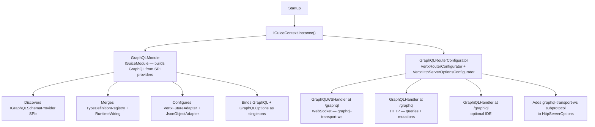
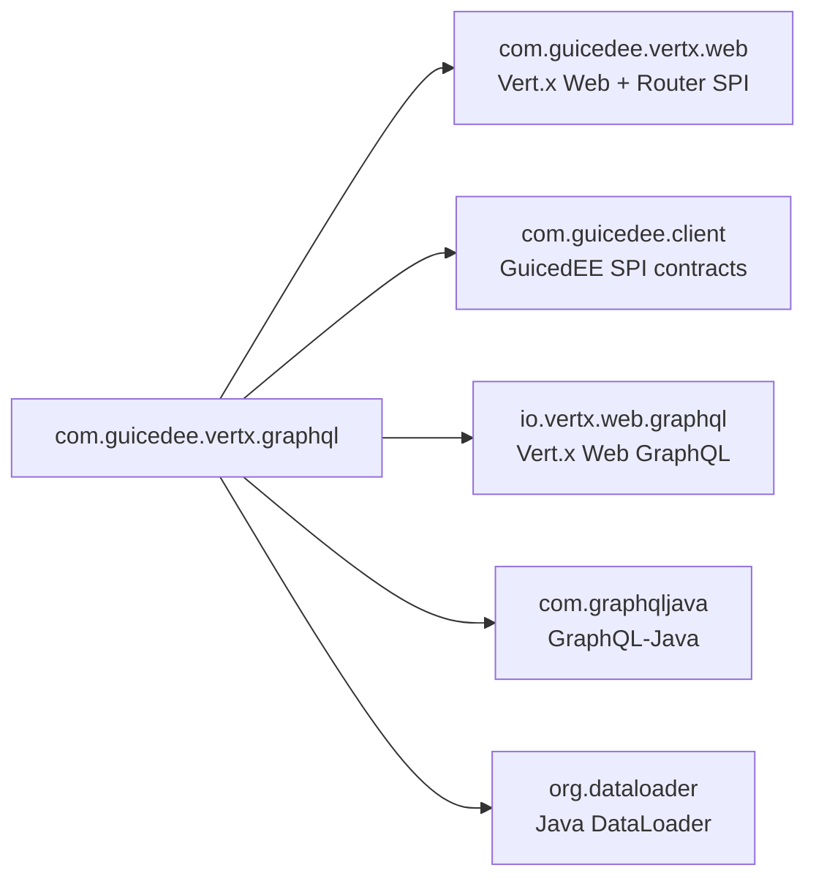

# GuicedEE GraphQL

[](https://github.com/GuicedEE/GraphQL/actions/workflows/build.yml)
[](https://central.sonatype.com/artifact/com.guicedee/graphql)
[](https://www.apache.org/licenses/LICENSE-2.0)


**GraphQL integration for [GuicedEE](https://github.com/GuicedEE)** powered by [Vert.x Web GraphQL](https://vertx.io/docs/vertx-web-graphql/java/).
Add the dependency, implement an `IGraphQLSchemaProvider`, and the module auto-registers HTTP, WebSocket, and optional GraphiQL endpoints — zero manual router wiring required.

Built on [Vert.x 5](https://vertx.io/) · [GraphQL-Java](https://www.graphql-java.com/) · [Google Guice](https://github.com/google/guice) · JPMS module `com.guicedee.vertx.graphql` · Java 25+

## 📦 Installation

```xml
<dependency>
  <groupId>com.guicedee</groupId>
  <artifactId>graphql</artifactId>
</dependency>
```

<details>
<summary>Gradle (Kotlin DSL)</summary>

```kotlin
implementation("com.guicedee:graphql:2.0.1")
```
</details>

## ✨ Features

- **HTTP endpoint** — `GraphQLHandler` at `/graphql` (configurable) with automatic query/mutation support
- **WebSocket endpoint** — `GraphQLWSHandler` with `graphql-transport-ws` subprotocol for subscriptions, queries, and mutations
- **GraphiQL IDE** — optional browsable IDE at `/graphiql` (disabled by default for security)
- **SPI-driven schema** — contribute SDL type definitions and runtime wiring via `IGraphQLSchemaProvider`
- **DataLoader support** — register batch loaders via `IGraphQLDataLoaderProvider` (fresh per-request registry)
- **Auto-instrumented** — `VertxFutureAdapter` and `JsonObjectAdapter` configured automatically
- **Query batching** — toggleable via `GRAPHQL_BATCHING_ENABLED` environment variable
- **File uploads** — multipart request support toggleable via `GRAPHQL_UPLOADS_ENABLED` environment variable
- **Environment-driven config** — all paths and feature toggles configurable via system properties or environment variables
- **JPMS + ServiceLoader friendly** — fully modular with `module-info.java` and `META-INF/services` descriptors

## 🚀 Quick Start

**Step 1** — Add the dependency (see [Installation](#-installation)).

**Step 2** — Implement a schema provider:

```java
public class MySchemaProvider implements IGraphQLSchemaProvider<MySchemaProvider> {

    @Override
    public TypeDefinitionRegistry getTypeDefinitions() {
        return new SchemaParser().parse("""
            type Query {
                hello(name: String): String
            }
        """);
    }

    @Override
    public RuntimeWiring.Builder configureWiring(RuntimeWiring.Builder builder) {
        return builder.type("Query", b -> b.dataFetcher("hello",
            env -> "Hello, " + env.getArgument("name") + "!"));
    }
}
```

**Step 3** — Register via JPMS and META-INF:

```java
module my.app {
    requires com.guicedee.vertx.graphql;

    provides com.guicedee.vertx.graphql.services.IGraphQLSchemaProvider
        with my.app.MySchemaProvider;

    opens my.app to com.google.guice;
}
```

`META-INF/services/com.guicedee.vertx.graphql.services.IGraphQLSchemaProvider`:
```
my.app.MySchemaProvider
```

**Step 4** — Bootstrap GuicedEE:

```java
IGuiceContext.registerModuleForScanning.add("my.app");
IGuiceContext.instance().inject();
```

That's it. The GraphQL endpoint is live:

```
POST http://localhost:8080/graphql
{"query": "{ hello(name: \"World\") }"}
→ {"data": {"hello": "Hello, World!"}}
```

## 📐 Architecture



### Request lifecycle

```
HTTP POST /graphql
 → Vert.x Router
   → GraphQLHandler
     → Build per-request DataLoaderRegistry (IGraphQLDataLoaderProvider SPIs)
     → graphql-java execution
       → Data fetchers (return Future<T>, CompletionStage<T>, or plain values)
     → JSON response

WebSocket /graphql (graphql-transport-ws)
 → GraphQLWSHandler
   → graphql-java execution per message
   → Subscription → Publisher stream
```

## ⚙️ Configuration

All settings can be overridden via system properties or environment variables:

| Variable | Default | Description |
|---|---|---|
| `GRAPHQL_HTTP_PATH` | `/graphql` | HTTP endpoint path |
| `GRAPHQL_WS_ENABLED` | `true` | Enable GraphQL over WebSocket |
| `GRAPHQL_WS_PATH` | `/graphql` | WebSocket endpoint path |
| `GRAPHIQL_ENABLED` | `false` | Enable GraphiQL IDE |
| `GRAPHIQL_PATH` | `/graphiql` | GraphiQL mount path |
| `GRAPHQL_BATCHING_ENABLED` | `false` | Enable query batching |
| `GRAPHQL_UPLOADS_ENABLED` | `false` | Enable multipart file uploads |

## 📊 DataLoader Support

Implement `IGraphQLDataLoaderProvider` to register batch loaders:

```java
public class UserDataLoaderProvider implements IGraphQLDataLoaderProvider<UserDataLoaderProvider> {
    @Override
    public void configureDataLoaders(DataLoaderRegistry registry) {
        BatchLoader<String, User> userLoader = ids -> retrieveUsersByIds(ids);
        registry.register("users", DataLoaderFactory.newDataLoader(userLoader));
    }
}
```

A fresh `DataLoaderRegistry` is created for each request automatically.

## ⚡ Data Fetchers

Return Vert.x `Future<T>` directly from data fetchers — `VertxFutureAdapter` is auto-configured:

```java
DataFetcher<Future<List<User>>> fetcher = env -> {
    Future<List<User>> future = userService.findAll();
    return future;
};
```

Use `JsonObject` in results — `JsonObjectAdapter` is auto-configured.

## 📤 File Uploads

Enable multipart file uploads:

```bash
export GRAPHQL_UPLOADS_ENABLED=true
```

Add the `Upload` scalar to your wiring and use `FileUpload` from `DataFetchingEnvironment`.

> Note: The `BodyHandler` must be mounted on the router (provided by the `web` module).

## 🔌 SPI & Extension Points

| SPI | Purpose |
|---|---|
| `IGraphQLSchemaProvider` | Contribute SDL type definitions and runtime wiring |
| `IGraphQLDataLoaderProvider` | Register batch loaders per request |
| `VertxRouterConfigurator` | Customize the Vert.x `Router` (provided by `GraphQLRouterConfigurator`) |
| `VertxHttpServerOptionsConfigurator` | Customize `HttpServerOptions` (WebSocket subprotocol added automatically) |
| `IGuiceModule` | Contribute Guice bindings (provided by `GraphQLModule`) |

## 💉 Injecting the GraphQL Instance

The `GraphQL` instance is bound as a singleton. Inject it anywhere:

```java
@Inject
private GraphQL graphQL;
```

Or retrieve it programmatically:

```java
GraphQL graphQL = IGuiceContext.get(GraphQL.class);
```

## 🗺️ Module Graph



## 🧩 JPMS

Module name: **`com.guicedee.vertx.graphql`**

The module:
- **exports** `com.guicedee.vertx.graphql.services`, `com.guicedee.vertx.graphql`
- **uses** `IGraphQLSchemaProvider`, `IGraphQLDataLoaderProvider`
- **provides** `IGuiceModule` with `GraphQLModule`
- **provides** `VertxRouterConfigurator` with `GraphQLRouterConfigurator`
- **provides** `VertxHttpServerOptionsConfigurator` with `GraphQLRouterConfigurator`
- **opens** `graphql` and `implementations` packages to `com.google.guice`

## 🏗️ Key Classes

| Class | Package | Role |
|---|---|---|
| `GraphQLRouterConfigurator` | `implementations` | `VertxRouterConfigurator` + `VertxHttpServerOptionsConfigurator` — mounts HTTP, WS, GraphiQL handlers and adds WS subprotocol |
| `GraphQLModule` | `implementations` | `IGuiceModule` — builds `GraphQL` from SPI providers with `VertxFutureAdapter` + `JsonObjectAdapter` instrumentations |
| `GraphQLOptions` | (root) | Environment-driven configuration POJO for paths and toggles |
| `IGraphQLSchemaProvider` | `services` | SPI for contributing type definitions and runtime wiring |
| `IGraphQLDataLoaderProvider` | `services` | SPI for registering batch loaders per request |

## 🧪 Testing

```bash
mvn test
```

## 🤝 Contributing

Issues and pull requests are welcome — please add tests for new schema contributions, data loader integrations, or configuration changes.

## 📄 License

[Apache 2.0](https://www.apache.org/licenses/LICENSE-2.0)
